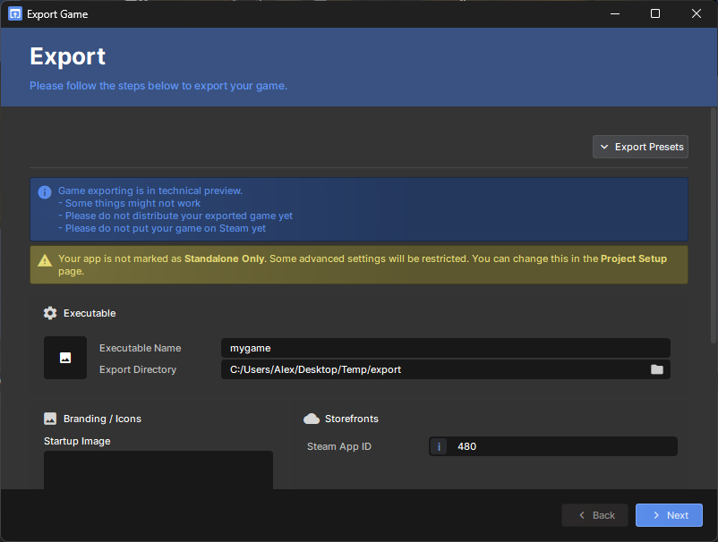

# Exporting Standalone

:::warning
Exporting standalone games is currently in preview. Games are approved individually by Valve, and you need a standalone license from Facepunch before distributing exported builds. Having access to the exporter or a Steam store page does not grant permission to distribute your game.

We're working towards opening this up more widely, but there is no guaranteed timeline. See [Getting Approval](#getting-approval) below for the current process.

:::

Export your game as a standalone executable and distribute it outside of the s&box platform.

* **Steam and beyond** - release on other storefronts, provided your game releases on Steam first or at the same time
* **No Facepunch royalties** - Facepunch takes no engine royalties or revenue share. Steam's standard terms and revenue share still apply
* **Open source engine** - full access to the engine source code
* **PC Only** - we don't have any console or mobile exports right now, this could always change in the future
* **Full .NET access** - no code whitelist, use any .NET API

Standalone games have no code whitelist restrictions and some additional APIs. See [Standalone Code](/exporting/standalone-code.md) for details.

## Getting Approval

Right now, we have to show your game to Valve for individual approval. In our opinion, that makes the bar a little higher than it should be. Our goal is for anyone to be able to make and publish the games they want, without us deciding which games deserve to be released. We'd like to get out of the way of that process, but we're not there yet.

1. Set up a Steam store page showing your game.
2. Email [garry@facepunch.com](mailto:garry@facepunch.com) with the store page link. Include screenshots or a gameplay video to help us understand the project.
3. We'll put the game forward to Valve for approval and work through the standalone license with you.

Approval is not automatic. Wait until you have Valve's approval and a standalone license from Facepunch before distributing exported builds, on Steam or anywhere else.

## Does My Game Have to Be on s&box?

No. Your game does not have to be published on the s&box platform at any point. You can use the engine to develop directly for standalone release. If your game is already on the platform, you do not have to keep it there after releasing standalone.

We hope you'll find it beneficial to make your game available on s&box, but that's your choice. It's your game.

## Player Models and Clothing

You must replace the default Citizen player models, including the sausage and human models, and Citizen clothing with your own assets before shipping a standalone game.

You can use Citizen models and clothing as placeholders during development and while setting up your Steam store page. This does not permit shipping them in the standalone release.

## Export Wizard

1. Click the **Project** menu
2. Click **Export…**
3. Set your icon, splash screen, and Steam App ID
4. Click **Next** and wait for the export to complete
5. Your executable will be in the output folder, click **Open Folder** to find it
