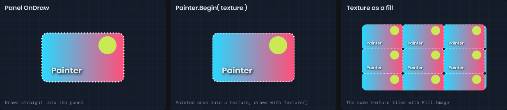
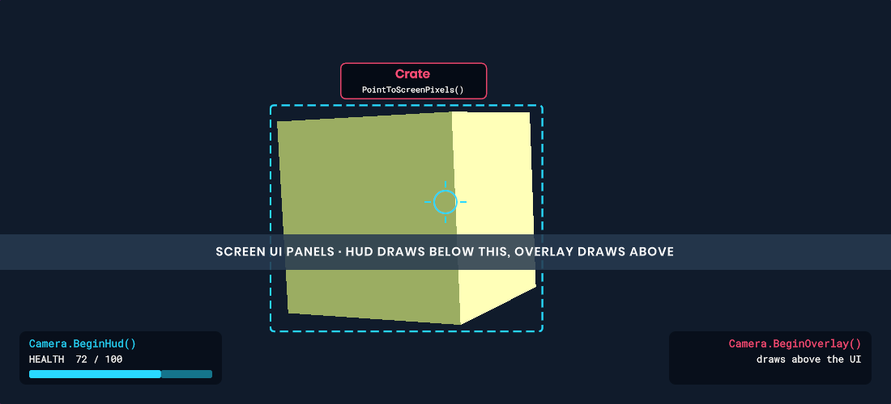

# Destinations

A painter always draws into something. The drawing code is identical whichever destination you use; what changes is where you get the painter, what its coordinates mean, and when the drawing shows up.



| Destination | How to get a painter | Coordinates |
|-------------|----------------------|-------------|
| Panel | Override `OnDraw( Painter painter )` | Panel layout pixels, from the panel's top-left |
| Camera HUD | `camera.BeginHud()` | Screen pixels, after post processing, below the UI |
| Camera overlay | `camera.BeginOverlay()` | Screen pixels, above the UI |
| Texture | `Painter.Begin( texture )` | Texture pixels |
| Command list | `Painter.Begin( commandList )` | Screen pixels, or a rectangle you provide |

Painters you get from `Begin*` must be disposed to submit their drawing. Use `using`. A panel's painter is owned by the panel and doesn't need disposing.

# Panels

Override `OnDraw` on any `Panel`. It's called every frame while the panel is visible, after the panel's own background and border are drawn and before its children. Coordinates start at (0, 0) in the panel's top-left, and `painter.Bounds` is the panel's size. They're the same units as your CSS layout, so a 100px wide panel has `Bounds.Width` of 100 regardless of screen resolution.

```csharp
public class Minimap : Panel
{
	public override void OnDraw( Painter painter )
	{
		painter.Fill = Color.Black.WithAlpha( 0.5f );
		painter.Circle( painter.Bounds );

		painter.Fill = Color.Green;
		foreach ( var player in Scene.GetAllComponents<PlayerController>() )
		{
			painter.Circle( WorldToMap( player.WorldPosition ), 3 );
		}
	}
}
```

Painting respects the panel's CSS: opacity, transforms and overflow clipping all apply on top of the drawing. Custom drawing is a good fit for charts, gauges, minimaps and anything else that would need hundreds of panels to build from stylesheets.

# Camera HUD and overlay

Every `CameraComponent` has two painters. `BeginHud` draws after post processing but underneath the UI. `BeginOverlay` draws above everything, which makes it ideal for debug overlays. Coordinates are pixels, starting at the camera's top-left, and `painter.Bounds` is the viewport size.



Their drawing is cleared at the start of every frame, so paint every frame from an update method:

```csharp
protected override void OnUpdate()
{
	using var painter = Scene.Camera.BeginHud();

	painter.Fill = Color.White;
	painter.Stroke = Stroke.Solid( Color.Black, 1 );
	painter.Circle( painter.Bounds.Center, 3 );
}
```

Both painters are shared: every component that calls `BeginHud` appends to the same frame, and each call must be disposed before the next one starts.

To draw something tracking a world position, paint from `OnPreRender` so the camera and object transforms are final for the frame:

```csharp
protected override void OnPreRender()
{
	var camera = Scene.Camera;
	var point = camera.PointToScreenPixels( Target.WorldPosition, out var behind );
	if ( behind ) return;

	using var painter = camera.BeginOverlay();

	painter.TextStyle = new TextStyle { FontSize = 14, Color = Color.White, Alignment = TextFlag.CenterBottom }
		.WithShadow( Color.Black, blur: 2 );

	painter.Text( Target.Name, new Rect( point.x - 100, point.y - 40, 200, 20 ) );
}
```

# Textures

`Painter.Begin( texture )` paints into a render target texture. This is useful for baking a complex drawing once and then displaying it as an image, or for generating textures at runtime.

```csharp
var texture = Texture.CreateRenderTarget()
	.WithSize( 256, 256 )
	.WithFormat( ImageFormat.RGBA8888 )
	.Create();

using ( var painter = Painter.Begin( texture ) )
{
	painter.Clear( Color.Transparent );

	painter.Fill = Fill.RadialGradient( Color.White, Color.Transparent );
	painter.Circle( new Vector2( 128, 128 ), 120 );
}
```

Existing pixels are kept unless you call `Clear`, so you can paint incrementally. Disposing the painter submits the drawing. Once painted, the texture can be used anywhere a texture can: a panel's background image, a material, or another painter's fill.

Call `texture.GetBitmap()` if you need to read the pixels back on the CPU.

# Command lists

For full control over when drawing happens, paint into a [Command List](/rendering/shaders/command-lists.md) and attach it to a camera at whichever stage you like.

```csharp
Rendering.CommandList commands;

protected override void OnEnabled()
{
	commands = new Rendering.CommandList( "My Drawing" );
	Scene.Camera.AddCommandList( commands, Rendering.Stage.AfterUI );
}

protected override void OnUpdate()
{
	commands.Reset();

	using var painter = Painter.Begin( commands );
	painter.Fill = Color.Red;
	painter.Rect( new Rect( 10, 10, 100, 100 ) );
}
```

By default the bounds are the screen. Pass a rectangle to `Begin` to use different bounds. Finish painting before you record other commands into the same list.

# 3D lines and billboards

Camera and command list painters can also draw simple world-space primitives. These ignore the 2D transform and clip, but use `Opacity` and `BlendMode`.

```csharp
using var painter = Scene.Camera.BeginHud();

// A 2px screen-width line between two world points, hidden behind geometry
painter.Line3D( start, end, Color.Yellow, thickness: 2 );

// A line 4 units thick in world space, always visible
painter.Line3D( start, end, Color.Red, thickness: 4, ignoreDepth: true, worldSpace: true );

// A camera-facing sprite, 32 units across
painter.Billboard( position, new Vector2( 32 ), texture, Color.White );
```

`Line3D` thickness is in screen pixels unless `worldSpace` is true. `Billboard` size is in world units unless `worldSpace` is false, in which case it's pixels. Both test against scene depth unless `ignoreDepth` is set, and neither writes depth.
