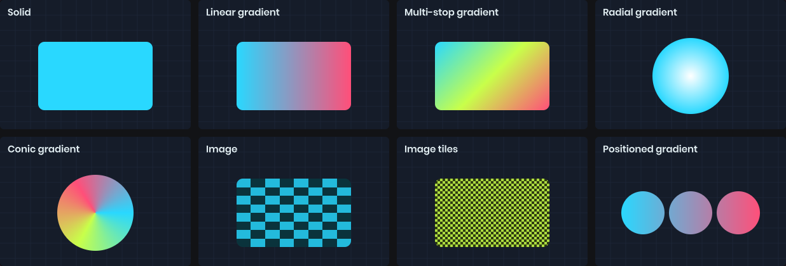
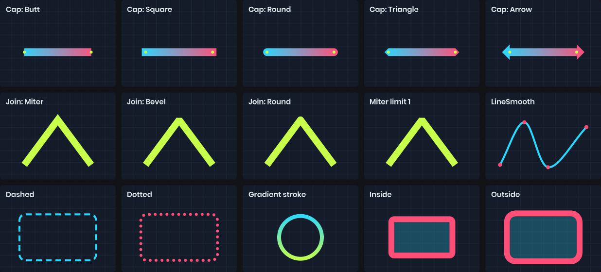

# Fill & Stroke

`Fill` paints the inside of a shape. `Stroke` paints along its edge. Both are properties on the painter; set them and every shape you draw afterwards uses them.

```csharp
painter.Fill = Color.Orange;
painter.Stroke = Stroke.Solid( Color.White, 2 );
painter.Circle( center, 40 );

painter.Stroke = Stroke.None;
painter.Circle( center + new Vector2( 100, 0 ), 40 );  // fill only
```

Both default to none, so a fresh painter draws nothing until you set one of them.

# Fills



A fill is a solid color, a gradient or an image. Colors convert implicitly.

```csharp
painter.Fill = Color.Red;
painter.Fill = Fill.Solid( Color.Red.WithAlpha( 0.5f ) );
painter.Fill = Fill.None;
```

## Gradients

Simple two-color gradients stretch across the bounds of each shape you draw.

```csharp
painter.Fill = Fill.LinearGradient( Color.Cyan, Color.Magenta );        // left to right
painter.Fill = Fill.LinearGradient( Color.Cyan, Color.Magenta, 90 );    // top to bottom
painter.Fill = Fill.RadialGradient( Color.White, Color.Transparent );   // center to edge
painter.Fill = Fill.ConicGradient( Color.Red, Color.Blue );             // sweeps around the center
```

For more than two colors, build the gradient from stops. Offsets go from 0 to 1, and two stops at the same offset make a hard edge.

```csharp
painter.Fill = Fill.LinearGradient( 45 )
	.WithStop( 0, Color.Red )
	.WithStop( 0.5f, Color.Yellow )
	.WithStop( 1, Color.Green );
```

Gradients can also be positioned in drawing coordinates instead of stretching to the shape. This is useful when several shapes should share one gradient.

```csharp
painter.Fill = Fill.LinearGradient( new Vector2( 0, 0 ), new Vector2( 300, 0 ), Color.Cyan, Color.Magenta );
painter.Fill = Fill.RadialGradient( center, center + new Vector2( 50, 0 ), Color.White, Color.Black );
```

## Images

`Fill.Image` tiles or stretches a texture inside the shape. By default it stretches to the shape's bounds.

```csharp
painter.Fill = texture;                                   // stretched
painter.Fill = Fill.Image( texture, tint: Color.Red );
painter.Fill = Fill.Image( texture, width: 64, repeat: BackgroundRepeat.Repeat );  // 64px tiles, height keeps the aspect ratio
painter.Fill = Fill.Image( texture, width: 64, height: 64, offsetX: 16 );
painter.Fill = Fill.Image( texture ).WithRotation( 45 );
```

Sizes and offsets are pixels, or a `Length.Percent` of the shape.

# Strokes



A stroke has a fill, a width, and a style. The fill can be anything a shape fill can be, including gradients and images.

```csharp
painter.Stroke = Stroke.Solid( Color.White, 4 );
painter.Stroke = Stroke.Dashed( Color.White, 4, dashLength: 12, gap: 6 );
painter.Stroke = Stroke.Dotted( Color.White, 4, gap: 4 );
painter.Stroke = Stroke.Solid( Fill.LinearGradient( Color.Cyan, Color.Magenta ), 4 );
painter.Stroke = Stroke.None;
```

Animate the `Offset` of a dashed stroke to make it march along the path:

```csharp
painter.Stroke = Stroke.Dashed( Color.White, 2, 8, 6, offset: Time.Now * 20 );
```

## Caps and joins

`Cap` controls how open lines and dashes end. `Join` controls how corners meet.

```csharp
painter.Stroke = Stroke.Solid( Color.White, 8 ).WithCap( Stroke.LineCap.Round );
painter.Stroke = Stroke.Solid( Color.White, 8 ) with { Join = Stroke.LineJoin.Bevel };
```

| Cap | Description |
|-----|-------------|
| `Butt` | Ends exactly at the point. The default. |
| `Square` | Extends half the stroke width past the point. |
| `Round` | A semicircle past the point. |
| `Triangle` | A pointed tip. |
| `Arrow` | A flared arrowhead. |

| Join | Description |
|------|-------------|
| `Miter` | Sharp corners, falling back to bevel beyond `MiterLimit`. |
| `Bevel` | Cuts the corner off. |
| `Round` | Rounds the corner. The default. |

## Alignment

On closed shapes the stroke is centered on the edge by default, so half of it overlaps the fill. You can move it fully inside or outside.

```csharp
painter.Stroke = Stroke.Solid( Color.White, 4 ).WithAlignment( Stroke.StrokeAlignment.Inside );
```

Open paths like lines and arcs are always centered.

# Outlines and shadows

`Outline` strokes around a rectangle without filling it, offset inward or outward. `RectShadow` draws a blurred shadow. Both are covered in [Shapes](shapes.md#rectangles).
