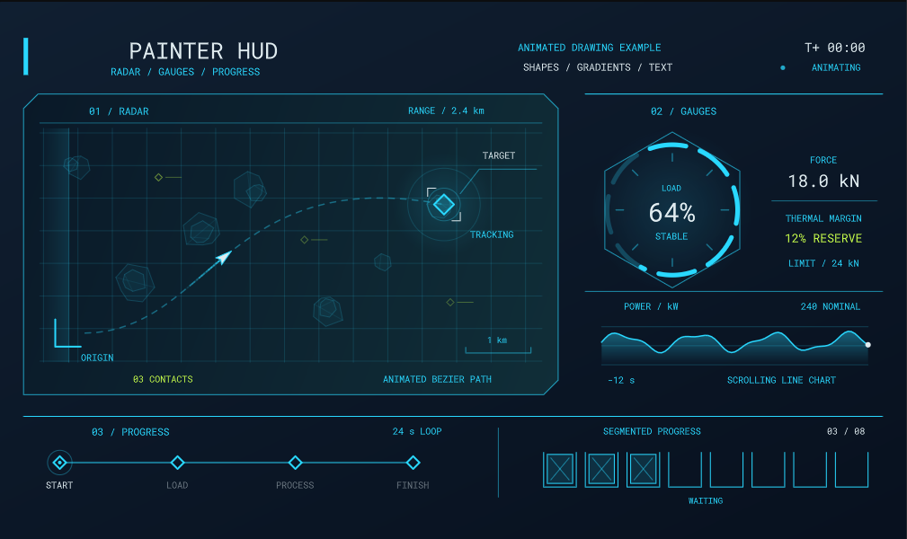

# Painter

Painter is the 2D drawing API. You use it to draw shapes, lines, text and images from code, without panels or stylesheets. Everything is batched and rendered on the GPU, so it's cheap enough to redraw every frame.



You can paint onto:

* A **panel**, by overriding `OnDraw( Painter painter )`.
* A **camera**, on the HUD or as an overlay above the UI.
* A **texture**, to bake a drawing you can reuse.
* A **command list**, to draw at any stage of rendering.

See [Destinations](destinations.md) for each of these.

# A first drawing

Here's a panel that draws a health bar. `OnDraw` is called every frame, and the painter's coordinates start at the panel's top-left corner.

```csharp
public class HealthBar : Panel
{
	public float Health { get; set; } = 0.75f;

	public override void OnDraw( Painter painter )
	{
		var bounds = painter.Bounds;

		// Background
		painter.Fill = Color.Black.WithAlpha( 0.5f );
		painter.Stroke = Stroke.Solid( Color.White, 2 );
		painter.Rect( bounds, 8 );

		// Bar
		var bar = bounds.Shrink( 4 );
		bar.Width *= Health;
		painter.Fill = Fill.LinearGradient( Color.Red, Color.Orange );
		painter.Stroke = Stroke.None;
		painter.Rect( bar, 4 );

		// Label
		painter.TextStyle = new TextStyle { FontSize = 16, Color = Color.White, Alignment = TextFlag.Center };
		painter.Text( $"{Health * 100:0}%", bounds );
	}
}
```

The same code works on the camera HUD, where the coordinates are screen pixels instead:

```csharp
protected override void OnUpdate()
{
	using var painter = Scene.Camera.BeginHud();

	painter.Fill = Color.White;
	painter.Circle( painter.Bounds.Center, 4 );
}
```

# How it works

Painter keeps a small amount of **drawing state**. Set it, then draw. Every shape you draw uses whatever the state is at the time.

| Property | What it does | Default |
|----------|--------------|---------|
| `Fill` | Paints the inside of closed shapes. A color, gradient or image. | `Fill.None` |
| `Stroke` | Paints the edge of shapes and the body of lines. | `Stroke.None` |
| `TextStyle` | Font, size, color and alignment for `Text`. | White 16px Roboto |
| `Opacity` | Alpha multiplier for everything drawn. | `1` |
| `BlendMode` | How drawing blends with what's behind it. | `Normal` |
| `Transform` | Moves, rotates and scales the drawing axes. | Identity |

`Clip` restricts drawing to a rectangle, and `Scope()` saves the state so you can change it temporarily:

```csharp
using ( painter.Scope() )
{
	painter.Opacity = 0.5f;
	painter.Rotate( 45 );
	painter.Rect( rect );
}

// Opacity and transform are back to what they were
```

Nothing is drawn unless there's a fill or a stroke. If you draw a shape and nothing appears, that's usually why.

# Pages

* [Shapes](shapes.md) - rectangles, circles, arcs, polygons, lines, curves and symbols.
* [Fill & Stroke](fill-and-stroke.md) - solid colors, gradients, images, dashes, caps and joins.
* [Text](text.md) - drawing and measuring text.
* [Transforms & Clipping](state.md) - transforms, clipping, opacity, blend modes and scopes.
* [Layers & Filters](layers.md) - group drawing for opacity, blur, masks and backdrop effects.
* [Destinations](destinations.md) - panels, cameras, textures, command lists and 3D lines.
