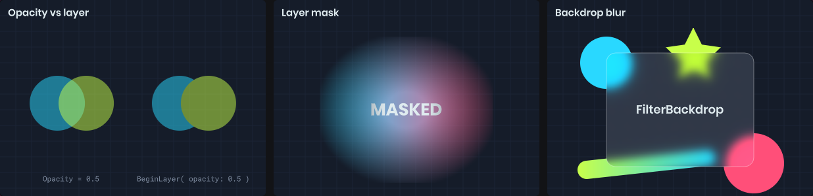

# Layers & Filters

A layer draws a group of shapes into an offscreen texture, then composites the result. That lets you fade, blur, recolor or mask a whole group at once.



# Layers

`BeginLayer` starts a layer covering a rectangle in the current drawing coordinates. Dispose it to composite. Anything outside the rectangle is clipped.

```csharp
using ( painter.BeginLayer( rect, opacity: 0.5f ) )
{
	painter.Fill = Color.Cyan;
	painter.Circle( center - new Vector2( 25, 0 ), 50 );

	painter.Fill = Color.Green;
	painter.Circle( center + new Vector2( 25, 0 ), 50 );
}
```

Compare this with setting `Opacity` to 0.5 and drawing the two circles directly. With `Opacity`, each circle is translucent and you see the cyan through the green where they overlap. With a layer, the group is drawn opaque and then faded as one.

Inside a layer the drawing state starts fresh: identity transform, full opacity, normal blending and no clip. Fill, stroke and text style carry over. Everything is restored when the layer is disposed, and layers nest, so dispose them in reverse order.

# Filters

Pass a `Filter` to blur or color-adjust the completed layer.

```csharp
var filter = new Painter.Filter
{
	Blur = 6,
	Saturation = 0,
	Brightness = 1.2f
};

using ( painter.BeginLayer( rect, filter: filter ) )
{
	painter.Texture( icon, rect );
}
```

| Property | Range | Effect |
|----------|-------|--------|
| `Blur` | 0+ | Gaussian blur radius in pixels. |
| `Brightness` | 0+ | 1 is unchanged, 0 is black. |
| `Contrast` | 0+ | 1 is unchanged, 0 is flat gray. |
| `Saturation` | 0+ | 1 is unchanged, 0 is grayscale. |
| `Sepia` | 0 to 1 | Sepia tone. |
| `Invert` | 0 to 1 | Color inversion. |
| `HueRotation` | degrees | Rotates every hue. |
| `Tint` | color | Multiplied over the result, including alpha. |

`new Painter.Filter()` is the identity, so you only need to set what you want to change.

# Masks

A `Mask` hides parts of the layer using a texture. By default the texture's alpha controls visibility; `MaskMode.Luminance` uses brightness instead.

```csharp
var mask = new Painter.Mask( maskTexture, rect );

using ( painter.BeginLayer( rect, mask: mask ) )
{
	painter.Fill = Fill.LinearGradient( Color.Cyan, Color.Magenta );
	painter.Rect( rect );
}
```

The mask rectangle is in drawing coordinates and can be rotated, repeated or sized independently of the layer. A soft radial mask is an easy way to vignette or feather a drawing.

# Backdrop filters

`FilterBackdrop` applies a filter to whatever is already drawn behind a rectangle, without needing a layer. It's how you get frosted glass panels.

```csharp
// Draw the scene content first...
painter.Texture( background, painter.Bounds );

// ...then blur what's behind the card and draw the card on top
painter.FilterBackdrop( card, new Painter.Filter { Blur = 12, Saturation = 1.4f }, corners: 16 );

painter.Fill = Color.White.WithAlpha( 0.1f );
painter.Stroke = Stroke.Solid( Color.White.WithAlpha( 0.3f ), 1 );
painter.Rect( card, 16 );
```

The backdrop only sees what the painter has drawn so far in this destination. On a camera HUD, that includes the rendered scene behind it.
