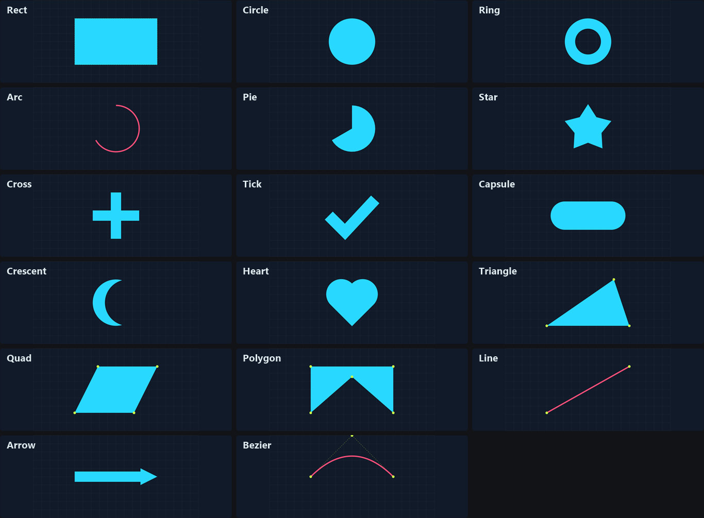
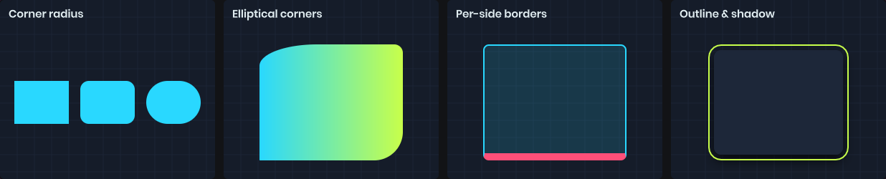

# Shapes

Every shape uses the current [Fill and Stroke](fill-and-stroke.md). Closed shapes are filled and then stroked around their edge. Open shapes like lines, arcs and curves only use the stroke.

All sizes are in drawing pixels. Angles are in degrees, clockwise, starting from the right.



# Rectangles



```csharp
painter.Fill = Color.White;
painter.Rect( new Rect( 10, 10, 200, 100 ) );

// One radius for every corner
painter.Rect( rect, 12 );

// Elliptical corners: top-left, top-right, bottom-right, bottom-left
painter.Rect( rect, new Painter.CornerRadii( new Vector2( 30, 10 ), new Vector2( 10 ), new Vector2( 0 ), new Vector2( 10 ) ) );
```

Radii that are too big for the rectangle are clamped, the same way CSS does it.

For a CSS-style box with a different border on each side, there's an overload that takes border widths and colors. Border widths are left, top, right, bottom.

```csharp
painter.Rect( rect, new Vector4( 1, 1, 1, 4 ), Color.Gray, Color.Gray, Color.Gray, Color.Red, 6 );
```

`Outline` draws a rectangular outline using the stroke. At zero offset its inner edge follows the rectangle; positive offsets push it outward.

```csharp
painter.Stroke = Stroke.Solid( Color.Cyan, 2 );
painter.Outline( rect, cornerRadius: 8, offset: 4 );
```

`RectShadow` draws a soft drop shadow (or an inset shadow) for a rectangle.

```csharp
painter.RectShadow( rect, corners: 8, color: Color.Black.WithAlpha( 0.6f ), blur: 12, offset: new Vector2( 0, 4 ) );
```

# Circles, rings, arcs and pies

```csharp
painter.Circle( center, 40 );                       // radius
painter.Circle( new Vector2( 100, 50 ), new Vector2( 80, 40 ) ); // ellipse from center and size
painter.Circle( rect );                             // ellipse fitted to a rectangle

painter.Ring( center, innerRadius: 30, outerRadius: 40 );
painter.Ring( center, 30, 40, startAngle: 0, sweepAngle: 270 );  // a ring sector

painter.Arc( center, radius: 40, startAngle: -90, sweepAngle: 180 ); // stroke only
painter.Pie( center, radius: 40, startAngle: 0, sweepAngle: 90 );
```

Negative sweeps go counter-clockwise. A sweep of 360 or more draws a full circle with no seam. Arcs are a good fit for radial progress bars:

```csharp
painter.Stroke = Stroke.Solid( Color.White.WithAlpha( 0.2f ), 6 );
painter.Arc( center, 40, -90, 360 );

painter.Stroke = Stroke.Solid( Color.Cyan, 6 ).WithCap( Stroke.LineCap.Round );
painter.Arc( center, 40, -90, 360 * progress );
```

# Polygons

```csharp
painter.Triangle( a, b, c );
painter.Quad( a, b, c, d );                // vertices in perimeter order
painter.Polygon( [a, b, c, d, e, f] );     // any number of vertices, concave is fine
```

`Polygon` uses the even-odd fill rule, so a self-intersecting outline leaves holes. The closing edge is implied. To draw only an outline, set `Fill.None`.

# Lines and curves

Lines are open, so they only use the stroke. Their width comes from `Stroke.Width`.

```csharp
painter.Stroke = Stroke.Solid( Color.White, 3 );

painter.Line( from, to );
painter.Line( [a, b, c, d] );          // connected segments, joined using Stroke.Join
painter.LineSmooth( [a, b, c, d] );    // a smooth curve through the points

painter.Bezier( from, control, to );                // quadratic
painter.Bezier( from, control1, control2, to );     // cubic
```

There's no vertex limit on `Line` and `Polygon`, so you can draw charts and plots directly:

```csharp
Span<Vector2> points = stackalloc Vector2[64];
for ( int i = 0; i < points.Length; i++ )
{
	float t = i / (points.Length - 1f);
	points[i] = new Vector2( t * bounds.Width, bounds.Height * (0.5f + MathF.Sin( t * 10 + Time.Now ) * 0.4f) );
}

painter.Line( points );
```

# Symbols

A few common symbols are built in, so you don't have to construct them from polygons.

```csharp
painter.Star( center, bodyRadius: 20, spikeLength: 20, points: 5 );
painter.Cross( center, width: 6, length: 40 );
painter.Tick( center, width: 6, length: 40 );
painter.Arrow( from, to, width: 6, headSize: 20 );
painter.Capsule( from, to, fromRadius: 10, toRadius: 10 );
painter.Crescent( center, radius: 30, cutoutRadius: 26, cutoutOffset: new Vector2( 12, -4 ) );
painter.Heart( center, size: 50 );
```

A `Star` with zero spike length is a regular polygon. A `Capsule` with different radii tapers between the two ends.

# Images

`Texture` draws a texture into a rectangle, ignoring the fill and stroke. For more control over tiling, sizing and offset, use an image [Fill](fill-and-stroke.md#images) with `Rect` instead.

```csharp
painter.Texture( texture, rect );
painter.Texture( texture, rect, Color.Red );  // tinted
```
