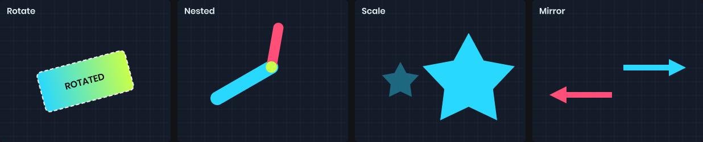
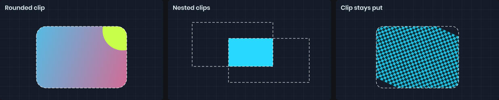
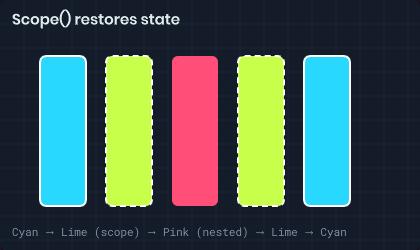

# Transforms & Clipping

Besides fill, stroke and text style, the painter carries a transform, a clip, an opacity and a blend mode. All of them apply to everything you draw after setting them, and all of them are saved and restored by `Scope()`.

# Transforms



`Translate`, `Rotate` and `Scale` move the drawing axes. They compound, so each call is relative to the last. Stroke widths and text scale along with the shapes.

```csharp
painter.Translate( painter.Bounds.Center );  // origin is now the panel center
painter.Rotate( Time.Now * 90 );            // spin around it
painter.Scale( 2 );

painter.Fill = Color.White;
painter.Rect( new Rect( -20, -20, 40, 40 ) );
```

Rotation is clockwise in degrees, around the current origin. To rotate around a shape's center, translate to the center first and draw the shape around zero.

A negative scale mirrors the drawing:

```csharp
painter.Scale( -1, 1 );  // flip horizontally
```

You can also read and assign the whole matrix through `Transform`.

# Clipping



`Clip` restricts all further drawing to a rectangle, with optional rounded corners. It uses the transform in effect when you call it, so a clip set before a rotation stays put while the drawing rotates inside it.

```csharp
using ( painter.Scope() )
{
	painter.Clip( new Rect( 0, 0, 200, 100 ), 16 );

	painter.Fill = texture;
	painter.Rect( new Rect( -50, -50, 300, 200 ) );  // only the clipped region shows
}
```

Clips nest: a second `Clip` intersects with the first. On panels, the panel's own CSS overflow clipping applies too.

# Opacity and blend modes

`Opacity` multiplies the alpha of everything drawn. `BlendMode` changes how it combines with what's already there.

```csharp
painter.Opacity = 0.5f;
painter.BlendMode = BlendMode.Multiply;
```

| Blend mode | Effect |
|------------|--------|
| `Normal` | Standard alpha blending. |
| `Multiply` | Darkens by multiplying colors. |
| `Lighten` | Keeps the lighter of the two colors. |
| `PremultipliedAlpha` | For textures with premultiplied alpha. |

On panels, `Opacity` stacks with the panel's CSS `opacity`. To fade a group of overlapping shapes as one, without the overlap showing through, use a [layer](/ui/painter/layers.md) instead.

# Scopes



`Scope()` snapshots every piece of drawing state and restores it when disposed. Use it whenever you change state for just part of a drawing.

```csharp
painter.Fill = Color.White;

using ( painter.Scope() )
{
	painter.Fill = Color.Red;
	painter.Translate( 50, 0 );
	painter.Clip( rect );
	painter.Circle( center, 10 );
}

painter.Circle( center, 10 );  // white, untranslated, unclipped
```

Scopes nest. Dispose them in the reverse order you opened them, which `using` does for you.
