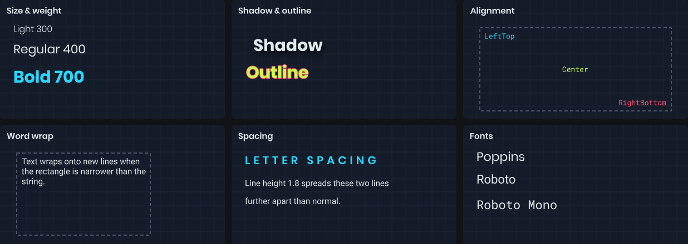

# Text

`Text` draws a string inside a rectangle using the painter's `TextStyle`. The rectangle is the layout area: text is aligned within it and wraps inside it when you ask it to.



```csharp
painter.TextStyle = new TextStyle
{
	FontName = "Roboto",
	FontSize = 24,
	FontWeight = 700,
	Color = Color.White,
	Alignment = TextFlag.Center
};

painter.Text( "Hello!", painter.Bounds );
```

The default style is white, 16px Roboto, aligned to the top-left.

# Styling

`TextStyle` is a record, so you can tweak a copy with `with` or the fluent helpers. Helpers are handy for sharing a base style and varying it.

```csharp
var heading = TextStyle.Default.WithSize( 28 ).WithBold().WithColor( Color.Cyan );
var small = heading.WithSize( 12 ).WithBold( false ).WithColor( Color.Gray );

painter.TextStyle = heading;
painter.Text( "Score", rect );

painter.TextStyle = small;
painter.Text( "Last round: 1240", rect );
```

| Property | Helper | Notes |
|----------|--------|-------|
| `FontName` | `WithFont` | Falls back to the default font if unavailable. |
| `FontSize` | `WithSize` | In pixels. On a panel, scaled the same as CSS font sizes. |
| `FontWeight` | `WithWeight`, `WithBold` | 100 to 900. Normal is 400, bold is 700. |
| `Italic` | `WithItalic` | |
| `Color` | `WithColor` | Alpha applies to the text and its effects. |
| `Alignment` | `WithAlignment` | `TextFlag` values, see below. |
| `LineHeight` | `WithLineHeight` | Multiplier, 1 is normal. |
| `LetterSpacing`, `WordSpacing` | `WithLetterSpacing`, `WithWordSpacing` | Extra pixels. |
| `Shadow` | `WithShadow`, `WithoutShadow` | One drop shadow with blur and offset. |
| `Outline` | `WithOutline`, `WithoutOutline` | One outline with a width. |

```csharp
painter.TextStyle = TextStyle.Default
	.WithSize( 32 )
	.WithShadow( Color.Black, blur: 4, offset: new Vector2( 2, 2 ) )
	.WithOutline( Color.Black, width: 2 );
```

# Alignment and wrapping

`Alignment` combines a horizontal and vertical position with layout flags.

```csharp
painter.TextStyle = painter.TextStyle with { Alignment = TextFlag.RightBottom };
painter.TextStyle = painter.TextStyle with { Alignment = TextFlag.CenterTop | TextFlag.WordWrap };
```

| Flag | Description |
|------|-------------|
| `LeftTop`, `Center`, `RightBottom`, ... | Position within the rectangle. |
| `WordWrap` | Wrap at word boundaries to fit the width. |
| `WrapAnywhere` | Wrap between any characters. |
| `SingleLine` | Never wrap. |
| `DontClip` | Let text overflow the rectangle. |

# Measuring

`MeasureText` tells you how big a string will be with the current style, without drawing it. Use it to size a background behind a label, or to lay text out next to other shapes.

```csharp
painter.TextStyle = TextStyle.Default.WithSize( 18 );

var size = painter.MeasureText( name );
var box = new Rect( position, size + new Vector2( 16, 8 ) );

painter.Fill = Color.Black.WithAlpha( 0.7f );
painter.Rect( box, 4 );
painter.Text( name, box.Shrink( 8, 4 ) );
```

There's also an overload that takes a rectangle and returns the exact rectangle `Text` will draw into, after alignment. Passing a size limits the layout width, so wrapped text measures correctly.
