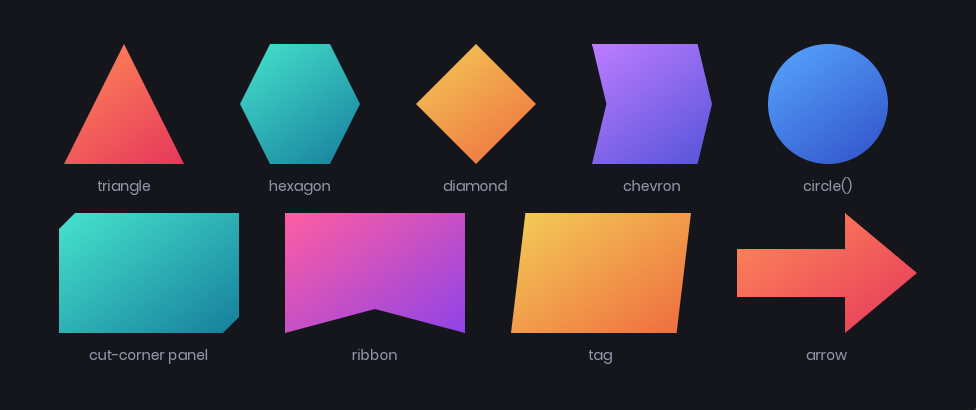
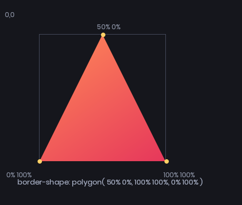
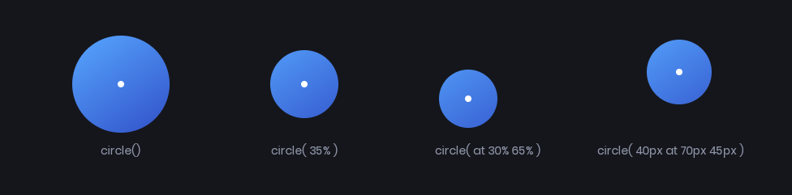
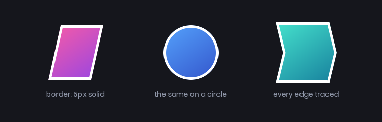
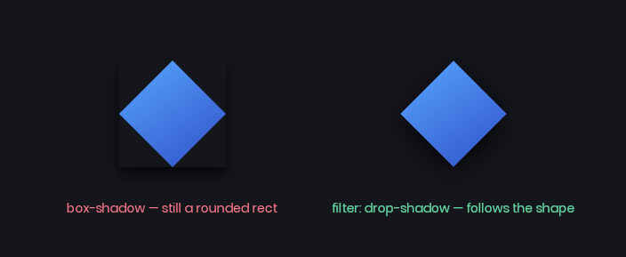
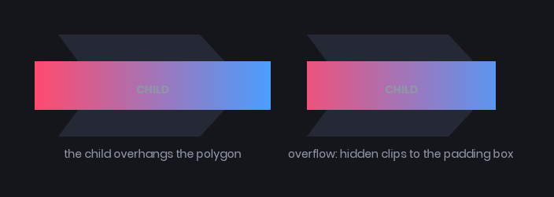

# Border Shape

`border-shape` generalises `border-radius` from rounded corners to an arbitrary polygon or a circle. Panels don't have to be rectangles.

```css
.tag
{
  border-shape: polygon( 0% 0%, 100% 0%, 90% 100%, 0% 100% );
}
```



Shapes are drawn with signed distance fields, so edges are antialiased and a normal `border` traces the shape instead of the box. Hit testing follows the shape too - the corners you cut out stop being clickable.

# Values

| Value | Description |
|-------|-------------|
| `none` | The default. The panel is a rounded rectangle, as usual. |
| `polygon( x y, x y, ... )` | Between 3 and 8 points. |
| `circle( radius at x y )` | Both parts are optional. |

## polygon()

Each point is an `x y` pair of `Length` values, measured from the top left of the border box. Percentages resolve against the panel's own width and height, so a shape written in percentages fits whatever size the panel ends up.

```css
.triangle { border-shape: polygon( 50% 0%, 100% 100%, 0% 100% ); }
.hexagon  { border-shape: polygon( 25% 0%, 75% 0%, 100% 50%, 75% 100%, 25% 100%, 0% 50% ); }
```



Points can mix units and use `calc()`:

```css
border-shape: polygon( 0% 0%, 100% 0%, calc(100% - 12px) 100%, 12px 100% );
```

Concave shapes are fine - the notch in a chevron stays outside the panel.

:::info
A polygon can have at most **8** points. Anything with fewer than 3 or more than 8 is rejected and the property is ignored.
:::

## circle()

```css
border-shape: circle();                  /* biggest circle that fits, centred */
border-shape: circle( 45% );             /* explicit radius, still centred */
border-shape: circle( at 25% 60% );      /* moved off centre */
border-shape: circle( 42px at 60px 45px );
```



The centre defaults to `50% 50%`, and both coordinates must be given together if you give either. A percentage centre resolves against width and height like a polygon point does.

Leave the radius out and you get the closest-side circle - the largest one that fits from that centre. A percentage radius resolves against the box's normalized diagonal, `sqrt(w² + h²) / sqrt(2)`, matching web `circle()`.

# What it affects

A border shape changes what the panel itself paints, in the same way `border-radius` does:

* **Background** - colors, gradients and images are clipped to the shape.
* **Borders** - a uniform `border` follows every edge of the shape.
* **Hit testing** - `:hover`, clicks and `Panel.IsInside` all use the shape, on the CPU, matching what you see.
* **Filters** - `filter: drop-shadow(...)` shadows the shape, not the box.



:::warning
`box-shadow` is the exception - it's still drawn as a rounded rectangle from your `border-radius`, so it will poke out from under a shaped panel. Use `filter: drop-shadow(...)` instead, which follows the shape.
:::



```css
.diamond
{
  border-shape: polygon( 50% 0%, 100% 50%, 50% 100%, 0% 50% );
  border: 4px solid white;
  background-color: #3150c8;
  filter: drop-shadow( 0px 4px 8px #05040acc );
}
```

It does **not** shape descendants. Children lay out and draw against the normal rectangular box, and `overflow: hidden` clips them to the padding box rather than to the shape. Text inside a `circle()` panel will happily overhang it, so give shaped panels enough padding for their content.



:::warning
`border-shape` replaces `border-radius` while it's set - the two don't combine. Set it back to `none` if you want your corner radii back.
:::

:::warning
`border-shape` can't be transitioned or animated. It snaps between values, so a `:hover` rule that changes the shape changes it instantly. Animate `transform`, `background-color` or `border-color` alongside it instead.
:::

# Some shapes to steal

```css
/* Breadcrumb / chevron */
.crumb { border-shape: polygon( 0% 0%, 88% 0%, 100% 50%, 88% 100%, 0% 100%, 12% 50% ); }

/* Cut-corner sci-fi panel */
.hud-panel { border-shape: polygon( 16px 0%, 100% 0%, 100% calc(100% - 16px), calc(100% - 16px) 100%, 0% 100%, 0% 16px ); }

/* Ribbon end */
.ribbon { border-shape: polygon( 0% 0%, 100% 0%, 100% 100%, 50% 80%, 0% 100% ); }

/* Slanted tag */
.tag { border-shape: polygon( 8% 0%, 100% 0%, 92% 100%, 0% 100% ); }

/* Arrow */
.arrow { border-shape: polygon( 0% 30%, 60% 30%, 60% 0%, 100% 50%, 60% 100%, 60% 70%, 0% 70% ); }

/* Avatar bubble */
.avatar { border-shape: circle(); }
```

Percentage shapes stretch with the panel, pixel shapes keep a fixed bevel however wide the panel gets. Mixing the two with `calc()` - as in the cut-corner panel above - gives you a shape that scales in one axis and stays crisp in the other.

# Styling in code

The resolved shape is on the panel's styles as [BorderShape](https://sbox.game/api/Sandbox.UI.BaseStyles):

```csharp
myPanel.Style.Set( "border-shape", "polygon( 50% 0%, 100% 100%, 0% 100% )" );

if ( myPanel.ComputedStyle.BorderShape.Kind == BorderShapeKind.Circle )
{
  // ...
}
```
